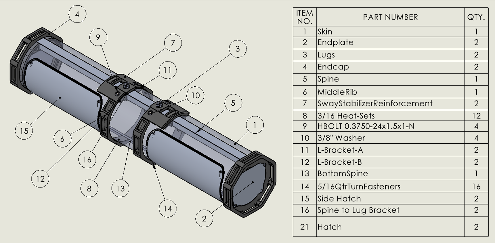
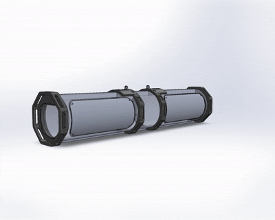

# B-2 Auxiliary Cargo Pod Concept

## Overview

This senior capstone project focused on the conceptual design and development of an auxiliary cargo pod for the B-2 Spirit in collaboration with StrikeWerx and the U.S. Air Force. Working as part of a multidisciplinary engineering team, the project emphasized systems integration, mechanical design, manufacturability, and iterative product development while satisfying project-defined performance and packaging requirements.

My primary contributions included mechanical design, CAD modeling, assembly development, and engineering evaluation of the cargo pod concept using SolidWorks. Throughout the project, multiple design iterations were completed based on stakeholder feedback, engineering analysis, and team design reviews.

> **Note:** Due to project restrictions, this repository summarizes the engineering design process and my individual contributions without including proprietary or export-controlled information.

---

## Project Objectives

* Develop a conceptual auxiliary cargo pod meeting project-defined requirements.
* Create a mechanically robust and manufacturable design.
* Balance packaging constraints, structural considerations, and system integration.
* Produce professional engineering documentation and design deliverables.
* Collaborate effectively within a multidisciplinary engineering team.

---

## My Contributions

* Developed 3D CAD models and assemblies in SolidWorks.
* Designed mechanical components while considering manufacturability and assembly.
* Participated in concept generation, design reviews, and iterative design refinement.
* Produced engineering documentation supporting project development.
* Collaborated with teammates and project stakeholders throughout the design process.

---

## Engineering Process

The project followed a structured engineering design workflow:

1. Requirements Definition
2. Concept Generation
3. CAD Development
4. Design Review
5. Iterative Refinement
6. Final Design Presentation

---

## Design Considerations

Key engineering considerations included:

* Structural integration
* Packaging constraints
* Manufacturability
* Ease of assembly
* Maintainability
* Weight considerations
* Concept feasibility

---

## Technologies Used

### CAD & Design

* SolidWorks

### Engineering

* Mechanical Design
* Product Development
* Design for Manufacturing (DFM)
* CAD Modeling
* Engineering Documentation

---

## Lessons Learned

This project strengthened my experience in collaborative product development, mechanical system design, iterative engineering workflows, and communicating technical concepts to both engineering teams and external stakeholders.
